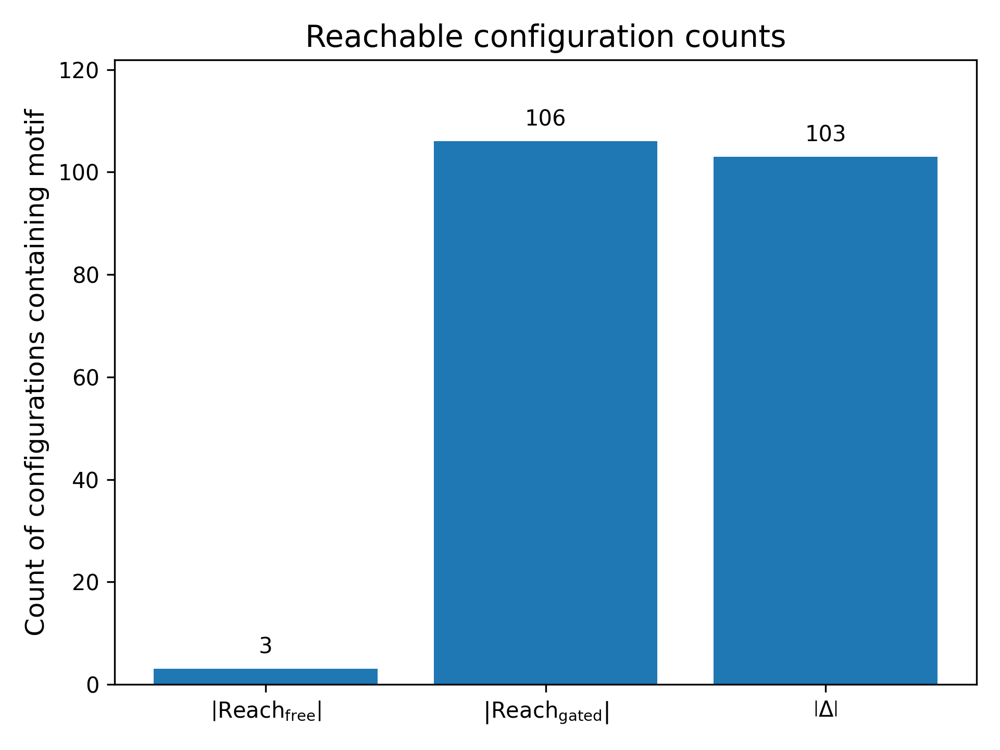
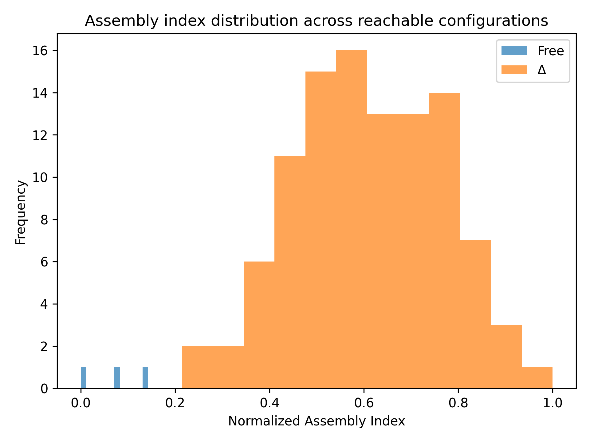
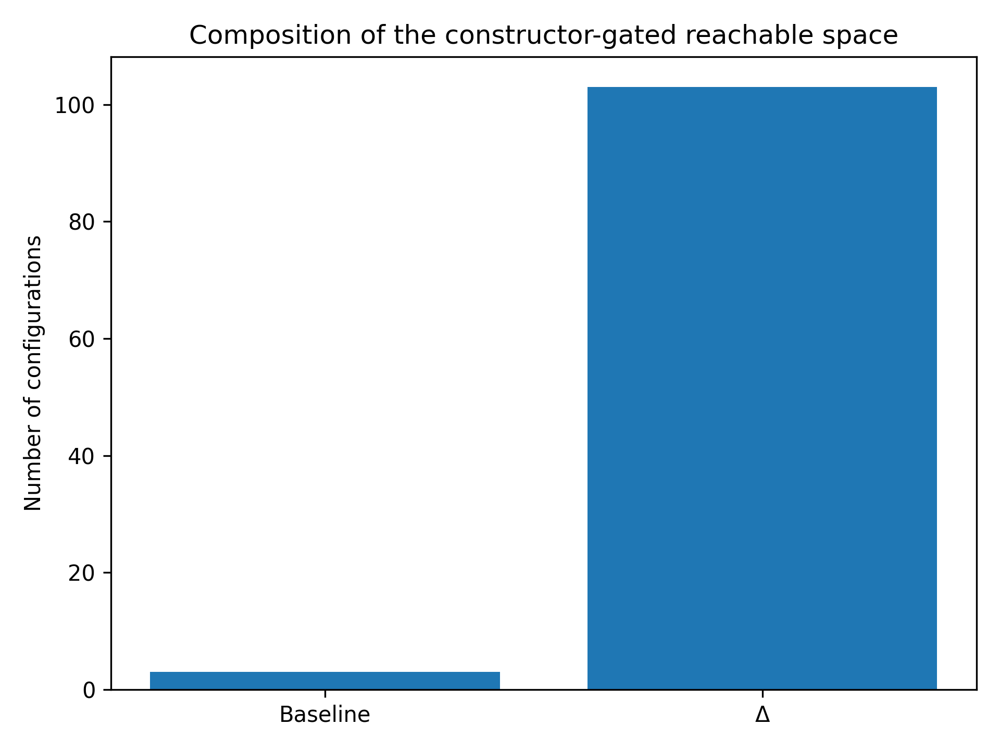
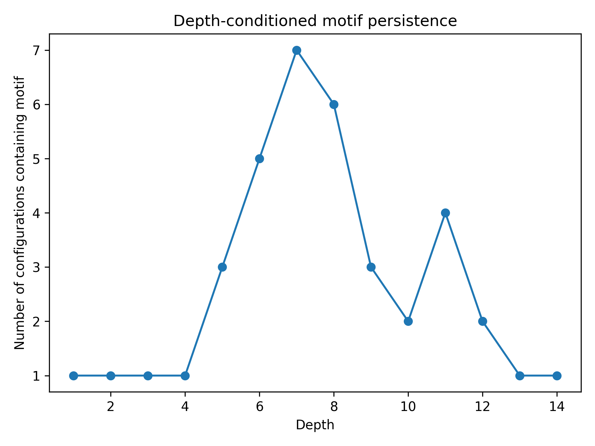

\begin{center}
Independent Researcher

ORCID: \href{https://orcid.org/0009-0008-7288-0218}{0009-0008-7288-0218}
\end{center}


## Abstract

We study a finite hypergraph rewrite system in which a distinguished constructor restricts the application of a subset of transformation rules to a local substrate neighbourhood. This typed separation induces a sharp reachability boundary between baseline dynamics and constructor-gated dynamics.

For a minimal substrate of size four, the system is exactly enumerable. Exhaustive breadth-first exploration of the canonicalized configuration space shows that the baseline rule set yields 3 reachable configurations, whereas the constructor-gated system yields 106, with 103 configurations accessible only under gating. These configurations exhibit a substantially higher mean constructive depth (Assembly Index, AI), defined as shortest-path depth in the reachability graph (0.611 versus 0.071 in the baseline).

A large fraction of these configurations contain a persistent substructure corresponding to the constructor’s executor-loop pattern, which emerges early and recurs across multiple depths. This persistence indicates reuse-driven branching in the gated reachability graph, in which previously constructed substructures are repeatedly incorporated into new configurations.

These results show that assembly-like complexity in this system arises not only from minimal construction pathways, but from the structure of the transformation rules that determine which configurations are reachable. Even in a small, exactly enumerable substrate, constraining rule application through a constructor produces a measurable expansion in both reachability and constructive depth.


## Introduction

Living systems reliably produce configurations of high constructive complexity while avoiding large regions of nominally accessible state space. Standard dynamical descriptions capture aspects of this behaviour but do not explicitly characterize which transformations are possible or unreachable under a given set of rules. Constructor-theoretic approaches address this by framing physical law in terms of possible and impossible transformations, while assembly-theoretic approaches provide measures of constructive complexity based on minimal construction pathways.

In this work, we study these ideas within a fully specified discrete setting. We introduce a minimal hypergraph rewrite system in which a typed, structurally inert constructor locally gates a subset of rewrite rules. This allows constraints on possible transformations and measures of constructive depth to be expressed and computed within a single formal substrate.

These frameworks are complementary but are typically studied in different settings. Constructor theory emphasizes constraints on transformations, whereas assembly theory measures the depth of constructions that do occur. The relationship between these perspectives—whether constraints on possible transformations systematically shape the complexity of reachable configurations—has not, to our knowledge, been explicitly computed in a fully enumerable discrete system.

This work investigates that question in a minimal hypergraph rewrite model. Hypergraph rewriting provides a discrete substrate in which local transformation rules act on multi-node relations. Within this framework, we construct a finite system in which a designated substructure—the constructor—enables a subset of rewrite rules that are otherwise unavailable. The constructor is implemented as a typed, structurally inert subhypergraph that is excluded from rule matching but gates the applicability of certain transformations within a local neighbourhood.

We perform exhaustive enumeration of the reachable configuration space from a fixed initial condition under two regimes: (i) unconstrained rewriting, and (ii) rewriting with constructor-gated rules enabled. The difference between these reachable sets defines a constructor-exclusive region of configuration space. We then measure the minimal constructive depth of configurations in both regimes using a graph-theoretic Assembly Index defined as shortest-path distance in the reachability graph.

The system is deliberately minimal: a fixed pool of seven nodes, bounded hyperedge rank, and a small set of local rewrite rules. This ensures that the configuration space is finite and can be enumerated exactly. All results reported are exact for the system studied and do not imply asymptotic scaling behaviour.

The central result is that constructor-gated rewriting induces both a sharp reachability boundary and a systematic shift in minimal constructive depth within this finite system. We interpret this as a minimal abstract precursor to the structural asymmetries associated with assembly-theoretic biosignatures. The claim is not that biological or chemical systems are reproduced, but that a comparable structural phenomenon arises in a fully specified and computable discrete substrate.

The remainder of the paper is organised as follows. Section 2 defines the hypergraph substrate, rewrite rules, and constructor architecture, and specifies the reachability computation. Section 3 reports the enumeration results. Section 4 discusses implications, limitations, and possible extensions.

***

## Section 2: Model

### 2.1 The Hypergraph Substrate

We work with finite hypergraphs of bounded rank at most 4 over a fixed node set

$V = \{0,1,2,3,4,5,6\}.$

Nodes are partitioned into two typed subsets:

- Constructor nodes:
  
    $C_{\mathrm{core}} = \{0,1,2,3\}$
- Substrate nodes:
  
    $SUB = \{3,4,5,6\}$

Node 3 serves as a shared interface between the constructor and the substrate.

A substrate configuration is defined as a set of hyperedges (S-edges), each of which is a subset of $SUB$ with cardinality 2, 3, or 4. Hyperedges are sets; multiplicity is not permitted. A node is active if it participates in at least one hyperedge, and inactive otherwise.

The configuration space is finite because the node set is fixed and hyperedge rank is bounded. Nodes are not created or destroyed; rule α activates previously inactive nodes.

Two configurations are considered equivalent if they are isomorphic under relabeling of active substrate nodes. Canonicalization quotients configurations by this equivalence, ensuring that isomorphic configurations are counted once in enumeration.

{#fig:substrate}

Configurations are bounded-rank hypergraphs with hyperedges of arity 2, 3, or 4. Nodes are active if incident to at least one hyperedge and inactive otherwise. Hyperedges are sets; multiplicity is not permitted.

***


{#fig:isomorphism}


***

### 2.2 The Rewrite Rules

The system evolves through local rewrite rules applied to substrate edges. Each rule matches a bounded pattern of hyperedges and produces a modified set of hyperedges. All rules preserve the rank constraint $\le$ 4.

The rules are as follows.

Let $A(s) \subseteq SUB$ denote the set of substrate nodes that participate in at least one hyperedge in configuration $s$.

**Rule $\alpha$ (activation).**  
A 2-edge $\{u,v\}$ is replaced by a 3-hyperedge $\{u,v,w\}$, where $w \in SUB \setminus A(s)$. This activates $w$.

**Rule $\beta$ (propagation).**  
A 3-hyperedge $\{u,v,w\}$ and a 2-edge $\{w,x\}$ sharing node $w$, with $x \notin \{u,v,w\}$, produce the 3-hyperedge $\{w,x,v\}$, while retaining the original 3-hyperedge.

**Rule $\gamma$ (merge).**  
Two 3-hyperedges sharing a 2-node subset are replaced by their union, forming a 4-hyperedge.

**Rule $\delta$ (split).**  
A 4-hyperedge $\{u,v,w,x\}$ is replaced by two overlapping 3-hyperedges given by a fixed canonical partition.

**Rule $\epsilon$ (loop closing).**  
Two 3-hyperedges sharing a 2-node subset generate a new 2-edge $\{u,x\}$ connecting their non-shared nodes.

Rules are partitioned into two classes:

- Unconstrained rules:
  
    $R_{\mathrm{free}} = \{\alpha, \beta\}$
- Constructor-gated rules:
  
    $R_c = \{\gamma, \delta, \epsilon\}$

Rules in $R_c$ are not applied unless their matched substrate nodes intersect the constructor neighbourhood defined below.

**Summary:**

| Rule       | Input->Output                        | Max Arity |
| ---------- | ------------------------------------ | --------- |
| $\alpha$   | 2-edge $\to$ 3-hyperedge                 | 3         |
| $\beta$    | 3-hyperedge + 2-edge $\to$ 2×3-hyperedge | 3         |
| $\gamma$   | 2×3-hyperedge $\to$ 4-hyperedge          | 4         |
| $\delta$   | 4-hyperedge $\to$ 2×3-hyperedge          | 3         |
| $\epsilon$ | 2×3-hyperedge $\to$ 2×3-hyperedge+2-edge | 3         |

-> Bounded rank $\le$ 4 preserved by inspection $\checkmark$

Note: Rule γ is the sole producer of 4-hyperedges, and rule $\delta$ is their  sole consumer. The 4-hyperedge generated by γ is consumed by $\delta$ within  one subsequent step, confirming that arity-4 structures are dynamic  intermediates, not stable configurations.

**Constructor-theoretic interpretation.**
We now briefly map the preceding formalism to the constructor-theoretic framework. In constructor theory, a task is a set of input–output attribute pairs on a substrate, and a constructor is a physical system that can cause the task to occur while approximately retaining its ability to do so.

In the present model, configurations of the substrate hypergraph define attributes, and each rewrite rule $r \in \{ \alpha,\beta,\gamma,\delta,\epsilon \}$ specifies a class of local transformations that can be interpreted as tasks, namely mappings from an input configuration $s$ to an output configuration $s'$ when the rule is applicable. The substrate hypergraph plays the role of the resource on which tasks act.

The designated constructor $C$ is represented by a set of typed, structurally inert edges that do not participate in matching or rewriting, but which gate the applicability of a subset of rules $R_c = \{\gamma,\delta,\epsilon\}$ through a locality constraint on the substrate. In this sense, $C$ enables a restricted class of transformations without being modified by them, satisfying the retention requirement by construction.

Within this model, a task is possible if there exists a sequence of rule applications realizing the corresponding input–output mapping under the specified gating constraints, and impossible otherwise. The results reported below concern how the presence of $C$ alters the space of possible tasks by enabling transformations that are otherwise unreachable.

**Rule set and partition.**  
The rule set $\{\alpha,\beta,\gamma,\delta,\epsilon\}$ is chosen as a minimal closed family over ranks $\{2,3,4\}$ that supports node introduction (α), propagation (β), composition (γ), decomposition (δ), and loop closure (ε). The partition into free and constructor-gated rules follows from locality: α and β act on single edges or simple overlaps, whereas γ, δ, and ε require coordinated transformations across multiple hyperedges. The designated constructor mediates such coordinated transformations through its substrate-side neighbourhood. The results below therefore test how constraining multi-edge coordination alters the space of reachable configurations, rather than presupposing the outcome.

***
### 2.3 Constructor and Neighborhood

The constructor $C$ is a fixed subhypergraph on nodes $\{0,1,2,3\}$, consisting of three typed edges:

- $\{0,1,2\}$ (executor)
- $\{0,2\}$ (internal loop)
- $\{2,3\}$ (interface)

These edges are excluded from rule matching and are never modified. They act only to gate rule applicability.

The constructor neighbourhood is defined as the set of substrate nodes at graph distance one from the interface node 3, computed from the current substrate configuration.

Constructor-gated rules are applied only when the nodes participating in a matched substrate pattern have non-empty intersection with this neighbourhood.

Only the designated instance of $C$ licenses gated rules. Subgraphs isomorphic to $C$ but not designated do not enable rule gating.

Retention of the constructor is enforced structurally: since its edges are excluded from rule matching, they remain unchanged throughout all transitions.


***

### 2.4 The Reachability Computation

We enumerate reachable configurations using breadth-first search (BFS) over canonicalized configurations.

Two runs are performed from the same initial configuration:

- Run 1: rules $R_{\mathrm{free}}$ only
- Run 2: rules $R_{\mathrm{free}} \cup R_c$, with $R_c$​ gated

Enumeration proceeds by applying all valid rule matches to each configuration and adding previously unseen canonical configurations to the search frontier. Termination is guaranteed because the configuration space is finite.

We define the Assembly Index (AI) of a configuration as the minimal depth at which it is reached under breadth-first enumeration of the canonicalized reachability graph, providing a model-internal measure of minimal constructive depth. This measure is not intended as a direct analogue of chemical assembly metrics; in particular, unlike assembly-theoretic definitions based on recursive construction from reusable subparts, it is defined purely in terms of reachability within a finite rewrite system.

{#fig:workflow}


***
## **3. Results**

All results reported in this section are obtained by exhaustive breadth-first enumeration of the reachable configuration space for the system defined in Section 2 with $|SUB| = 4$. All values are exact.

Two runs are performed from the same initial configuration $S_0 = \{\{3,4\}, \{3,5\}\}$:

- **Baseline run:** rules $R_{\mathrm{free}} = \{\alpha, \beta\}$
- **Constructor-gated run:** rules $R_{\mathrm{free}} \cup R_c$, with $R_c = \{\gamma, \delta, \epsilon\}$ gated by the constructor neighbourhood

The reachability sets are denoted:

$Reach_{\mathrm{free}} = Reach(S_0, R_{\mathrm{free}})$
$Reach_{\mathrm{gated}} = Reach(S_0, R_{\mathrm{free}} \cup R_c, C)$

The constructor-exclusive set is:

$\Delta = Reach_{\mathrm{gated}} \setminus Reach_{\mathrm{free}}$

Assembly Index is defined as shortest-path depth in the reachability graph.

### **3.1 Reachability Expansion Across the Constructor Boundary**

The size of the reachable configuration space differs substantially between the two regimes:


$$
|Reach_{\text{free}}| = 3
$$
$$
|Reach_{\text{gated}}| = 106
$$
$$
|\Delta| = 103
$$
$$
\frac{|\Delta|}{|Reach_{\text{gated}}|} = 0.9717
$$

The baseline system yields a small, closed set of configurations. The introduction of constructor-gated rules yields a substantially larger reachable set, of which the majority (97.17%) is not accessible under the baseline dynamics.

This establishes the existence of a non-trivial reachability boundary induced by constructor-gated rule availability. 

{#fig:reachability}

As shown in Figure 4, starting from the same initial seed $S_0$​, the baseline system yields 3 reachable configurations, whereas the constructor-gated system yields 106. The constructor-exclusive set $\Delta$ contains 103 configurations.

### **3.2 Assembly Index Distribution **

Assembly Index (AI), defined as normalised shortest-path depth from $S_0$, differs markedly between the baseline and constructor-exclusive configurations.

For the baseline reachable set:

$\text{mean}(AI_{\mathrm{free}}) = 0.0714,\quad \max = 0.1429$

For the constructor-exclusive set $\Delta$:

$\text{mean}(AI_{\Delta}) = 0.6110,\quad \max = 1.0000$

The difference in mean normalised Assembly Index is:

$\Delta_{\mathrm{AI}} = +0.5395$

The baseline configurations are confined to low depths, while configurations in $\Delta$ span the full normalised depth range.

This indicates that configurations accessible only under constructor-gated dynamics require substantially longer minimal construction sequences within the reachability graph.

{#fig:ai-distribution}

Histograms are computed using identical fixed-width bins over the interval $[0,1]$, enabling direct comparison between distributions. The baseline configurations are confined to low normalised Assembly Index values, whereas configurations in $\Delta$ span the full range and are concentrated at higher values, indicating a shift toward greater minimal constructive depth under constructor-gated dynamics.

### **3.3. Composition of Reachable Space**

The reachable space under constructor-gated dynamics is dominated by configurations not present in the baseline system:

- Baseline configurations: 3
- Constructor-exclusive configurations ($\Delta$): 103

Thus, baseline-accessible configurations constitute a small subset of the full reachable set when constructor-gated rules are enabled.

This indicates that the additional rules do not merely extend the baseline reachability graph but define a substantially different reachable region.


{#fig:delta}

Of the 106 configurations reachable under constructor-gated dynamics, 103 belong to the constructor-exclusive set $\Delta$, corresponding to 97.17% of the gated reachable space.


### **3.4. Substructure Reuse**

The enumeration reveals not only a sharp reachability asymmetry (Δ), but also recurrent substructures across the reachable configuration space. We examine one such recurrent motif to illustrate this reuse behaviour.

The executor-loop pattern reported in Table 2 corresponds to a composite structural predicate—namely the presence of a 3-hyperedge and a 2-edge sharing two nodes within a configuration—counted over configurations in $\Delta$, whereas the reuse analysis in Section 3.4 tracks the specific 3-hyperedge $\{3,4,6\}$. These are distinct measurements: the former captures a class of configurations satisfying a relational pattern, while the latter tracks a fixed local motif.

This motif is present in:

$38 \text{ out of } 106 \text{ configurations} \quad (35.85\%)$

and appears across depths ranging from 1 to 14.

Because Assembly Index is defined over minimal derivations, once a substructure is constructed, it can be reused across multiple downstream configurations without additional cost in path length.

This persistence indicates that certain substructures act as reusable intermediates rather than transient configurations.

This provides evidence of reuse-driven branching within the constructor-gated reachability graph.

{#fig:reuse}

As shown in Figure 7, the depth-conditioned persistence of the motif $\{3,4,6\}$ emerges at shallow depths and persists across a substantial portion of the reachable space.

For each derivation depth, the plotted value gives the number of reachable configurations at that depth containing the motif {3,4,6}.


### **3.5. Substrate-Size Variation**

To assess sensitivity to substrate size, we evaluate adjacent cases while holding the rule set and constructor architecture fixed.

Table 1. Reachable configuration counts for substrate sizes $|SUB|=3,4,5$ from fixed initial condition $S_0$, showing exact enumeration for $|SUB| \le 4$ and lower bounds for $|SUB|=5$, with constructor-gated dynamics producing a large exclusive set $\Delta$.

| SUB | Seed $S0$      | $Reach_{\mathrm{free}}$ | $Reach_{\mathrm{gated}}$ | $\Delta$ | Status         |
| --- | -------------- | ----------------------- | ------------------------ | -------- | -------------- |
| 3   | {{3,4}}        | 2                       | 2                        | 0        | exact / closed |
| 4   | {{3,4}, {3,5}} | 3                       | 106                      | 103      | exact / closed |
| 5   | {{3,4}, {3,5}} | 5                       | 20,000+                  | 19,995+  | open at cutoff |


Where  $Reach_{\mathrm{free}} = Reach(S_0, R_{\mathrm{free}})$ and 
$Reach_{\mathrm{gated}} = Reach(S_0, R_{\mathrm{free}} \cup R_c, C)$.

For $|SUB| = 3$, the baseline and gated systems coincide and no constructor-exclusive configurations arise.

For $|SUB| = 4$, a non-trivial constructor-exclusive set appears and is fully enumerable.

For $|SUB| = 5$, the reachable set under constructor-gated dynamics grows beyond practical exhaustive closure under the present BFS method, and reported values are lower bounds.

This indicates that $|SUB| = 4$ is the smallest substrate size at which a non-trivial constructor-induced reachability asymmetry is both present and exactly computable.

***
## Section 4: Discussion

### 4.1 What the deterministic result establishes

The deterministic results establish the core claim of this work: in a minimal computable hypergraph rewrite system, the presence of a constructor $C$ induces a sharp boundary in the space of possible substrate configurations. The configurations that become reachable only in the presence of $C$—the set $\Delta$—exhibit systematically higher Assembly Index than those reachable under the unconstrained rules alone. This asymmetry is categorical: configurations in $\Delta$ are unreachable without the constructor, and their elevated minimal constructive depth reflects the additional structure enabled by constructor-gated rules.

The $|SUB| = 4$ case is especially significant because it is exact. The baseline run reaches 3 configurations, whereas the constructor-gated run reaches 106, of which 103 belong to $\Delta$. The mean normalised Assembly Index of $\Delta$ is substantially higher than that of the baseline reachable set, and 92 configurations in $\Delta$ contain the system’s self-reproduction motif. These results establish that, in this minimal system, the presence of the constructor not only enlarges reachability but systematically reorganises the reachable space toward configurations of greater constructive depth.

The importance of this result lies not in scale but in exactness. The model is deliberately small, enabling exhaustive enumeration and exact shortest-path Assembly Index computation. The claim is therefore not that life has been simulated, nor that empirical molecular assembly thresholds have been matched. The claim is narrower: that a constructor-defined possibility boundary can generate a measurable complexity asymmetry in a fully specified discrete substrate. This is sufficient to establish a structural connection between possibility constraints and constructive depth.

The results show that assembly-like structural features—emergence, persistence, and reuse of substructures—arise not merely from combinatorial properties of configurations, but from the structure of the transformation rules under which those configurations are generated. In particular, the introduction of constructor-gated rules induces a reachability regime in which such features become prevalent. This suggests that assembly-theoretic signatures of complexity are contingent not only on minimal construction pathways, but on the underlying transformation algebra that determines which configurations are reachable at all.

### 4.2 Why typed separation matters

A central outcome of the model is that the typed separation between constructor and substrate is not a modelling convenience but a structural requirement. In early untyped versions, constructor edges participated in rewrite matching alongside substrate edges. Under those conditions, the constructor’s executor pattern became entangled with substrate dynamics, producing self-referential branching and eliminating any sharp possibility boundary.

The typed architecture resolves this by declaring constructor edges fixed and inert, while rewrite rules act only on substrate edges. This separation is conceptually load-bearing. A constructor that is structurally indistinguishable from its substrate cannot function as a constructor in the relevant sense, because it becomes both the agent of transformation and its object. Once that distinction collapses, locality, retention, and gating lose coherence.

By contrast, when constructor and substrate are typed separately, the constructor can act through a fixed interface while preserving its structure. Retention is then guaranteed by construction, and the absence of type-overlap violations across the reachable set confirms that this separation is maintained.

In this sense, the present model can be situated within a broader tradition of studying self-reproducing and constructive systems defined by local rules over discrete substrates, originating with von Neumann (1966).

More generally, this suggests that wherever constructive organisation is intended to be reusable, the bearer of the construction pattern must remain structurally distinct from the object being transformed. In this sense, the typed architecture is not only an implementation detail but a necessary condition for the existence of a well-defined possibility boundary.

### 4.3 Substrate-size dependence and minimal threshold

The substrate-size variation experiments suggest three qualitatively distinct regimes.

For $|SUB| = 3$, the baseline and constructor-gated runs coincide, with $\Delta = 0$. In this regime, the substrate is insufficient to realise the pattern combinations required for constructor-gated branching. The constructor is present formally, but its gated capabilities do not open a distinct region of possibility space.

For $|SUB| = 4$, constructor-gated complexity asymmetry becomes both possible and exactly enumerable. As shown in Table 1, this substrate size is the first at which the mechanism is complete and computationally transparent. The resulting system is therefore not merely an example, but an exactly enumerable instance of the phenomenon under study.

For $|SUB| = 5$, a different regime appears. The baseline run remains small, but the constructor-gated reachable set grows beyond practical exhaustive closure under the present breadth-first method. The system is finite, since the node set is fixed and hyperedge rank is bounded, implying a finite number of possible substrate edges, and hence a finite configuration space.

The relevant distinction is therefore not between finite and infinite reachability, but between regimes that are exactly enumerable and those that are finite but not exhaustible in practice. In this sense, $|SUB| = 4$ marks a threshold: the smallest system in which constructor-gated asymmetry is both present and exactly computable, while larger systems enter a more expansive regime of structured but non-exhaustible constructive branching.

The present result is established for a specific minimal rule set, and does not claim generality across all hypergraph rewrite systems. The extent to which constructor-gated reachability asymmetries arise under alternative rule specifications remains an open question.

The rules employed here are intentionally minimal and structured to expose the interaction between typed separation and local gating. The results should therefore be understood as demonstrating the existence of the effect, rather than its universality.

In this sense, the constructor-gated rule set defines a restricted set of possible tasks on the substrate, and the observed reachability boundary $\Delta$ can be interpreted as a shift in the space of possible transformations induced by the presence of $C$.

### 4.4 Interpretation: Rule Structure and Assembly-Like Complexity

The observed asymmetry between baseline and constructor-gated dynamics is not a consequence of scale or parameter choice, but of the structure of the transformation rules. Constraining a subset of rules to operate only within the constructor’s local neighbourhood alters the topology of the reachable configuration space, producing a sharp boundary between configurations that are generically accessible and those that require gating.

Within this gated region, reachable configurations exhibit both greater constructive depth and a higher incidence of persistent substructures. These effects arise because rule restriction enables the repeated incorporation of previously constructed substructures into new configurations, yielding reuse-driven branching in the reachability graph. The resulting increase in both reachability and minimal construction depth is therefore a consequence of how rule application is structured, rather than of the particular configurations encountered.

Although demonstrated here in a minimal, exactly enumerable system, this mechanism does not depend on the specific encoding or substrate size. The role of the constructor is to impose a constraint on rule application that reshapes the space of possible constructions. In this sense, the constructor acts not as an external addition to the system, but as a structural condition on which transformations are admissible.

These results indicate that assembly-like complexity in this setting is not solely a property of configurations or construction cost, but of the transformation rules that determine which configurations are reachable.

### 4.5 Scope and limitations

The strengths of the model are inseparable from its limitations. The system is deliberately abstract: a fixed node set, bounded hyperedge rank, a small set of local rewrite rules, and exact enumeration of the reachable configuration space. This design prioritizes tractability and conceptual clarity over realism. The rules are not derived from chemistry, and the Assembly Index is defined as shortest-path depth in a finite reachability graph. It is therefore a model-internal quantity and is not intended to be compared directly with empirical assembly thresholds in chemical systems. The model should be understood as an exact realization of a minimal system in which this constructive asymmetry arises, not as a simulation of biological or chemical processes.

Recent critiques of Assembly Theory (e.g., Jaeger, 2024) emphasize limitations in interpreting assembly-based measures as indicators of biological or chemical significance. The present use of Assembly Index is therefore strictly model-internal, defined as minimal reachability depth, and does not rely on such interpretations.

The present work occupies an intentionally narrow position between two broader domains. On one side, computational rewriting systems study the emergence of complex behaviour from simple local rules. On the other, assembly-theoretic approaches focus on the physical construction of complex structures and their potential role as biosignatures. The framework developed here does not aim to reproduce either domain. Instead, it isolates a specific structural question: how minimal architectural constraints—typed separation, locality, and retention—affect the set of constructible configurations and their minimal construction depth.

In this setting, the results can be interpreted as a concrete realization of a possibility boundary in a fully specified discrete system. The introduction of a typed, inert constructor that gates a subset of rewrite rules induces a non-trivial partition of the reachable configuration space. Configurations in the constructor-exclusive set $\Delta$ are not only unreachable under the baseline dynamics but also exhibit systematically greater minimal constructive depth. This establishes a structural link between constraints on possible transformations and the distribution of construction pathways.

The model is intentionally abstract and does not correspond to any specific physical or chemical substrate. Its purpose is to isolate a structural relationship between possibility constraints and constructive depth in a fully enumerable setting. Any connection to assembly-theoretic biosignatures should therefore be understood as a statement about structural form rather than physical realization or detection. In this limited sense, the constructor-gated reachability boundary $\Delta$ may be viewed as a minimal abstract precursor to structural features associated with assembly-theoretic biosignatures. In this sense, the model isolates the minimal conditions under which higher Assembly Index configurations become reachable.

To assess dependence on initial conditions, all 15 possible two-edge seeds over $|SUB| = 4$ were exhaustively evaluated using the deterministic reference implementation. Connected seeds consistently exhibit constructor-gated reachability expansion with non-empty $\Delta$ and elevated mean normalised Assembly Index, while disconnected seeds yield trivial reachability under both rule sets. The phenomenon is therefore robust across structurally productive seeds, with variation in scale but not in kind, and depends on sufficient initial connectivity to support interaction with the constructor neighbourhood.  Representative configurations are shown in Table 3, with complete results for all 15 seeds available in the reference implementation.

**Table 3.** Representative seed configurations illustrating robustness across connected seeds and collapse for disconnected seeds. Results are consistent across all 15 two-edge seeds.

| Seed          | Type         | \|R_free\| | \|R_gated\| | Δ   | Mean AI(Δ) |
| ------------- | ------------ | ---------- | ----------- | --- | ---------- |
| {{3,4},{3,5}} | connected    | 3          | 106         | 103 | 0.611      |
| {{3,4},{4,5}} | connected    | 3          | 115         | 112 | 0.641      |
| {{3,5},{4,5}} | connected    | 3          | 63          | 60  | 0.707      |
| {{3,4},{5,6}} | disconnected | 1          | 1           | 0   | —          |

The present analysis is restricted to exact reachability and minimal constructive depth in a finite system and does not address persistence under perturbation or stochastic effects. 

The present analysis does not address causal invariance—i.e., whether different rule application orders yield equivalent outcomes in the sense of Wolfram’s framework—which lies outside the scope of this work.

Within hypergraph-based approaches to constructive complexity, recent work on assembly in directed hypergraphs (Flamm et al., 2025) studies constructive complexity within such frameworks; the present model instead focuses on constructor-gated reachability and the resulting asymmetry in the space of possible transformations.

These results admit a natural interpretation within an Artificial Life framework. The constructor-gated reachability boundary Δ constitutes a minimal instance of structural asymmetry arising from local rules: the same substrate admits qualitatively different reachable regions under constructor-gated versus ungated dynamics, where the constructor is realized as a typed, persistent structure. The separation of constructor and substrate types enforces retention by construction, suggesting a minimal precondition for autonomy in the sense of maintaining organization under local transformation. Finally, the expansion of Δ under constructor-gated dynamics provides a bounded setting in which progressively higher Assembly Index configurations become reachable, offering a minimal scaffold for open-ended constructive elaboration without invoking stochastic or evolutionary mechanisms.

### 4.6 Conclusion

These results indicate that assembly-theoretic signatures of complexity depend not only on minimal construction pathways, but on the transformation rules that determine which configurations are reachable.

### Code Availability

The deterministic reference implementation used to generate the results and figures in this study is available at:

[https://github.com/Jean-YvesLG/constructor-hypergraph-rewrite](https://github.com/Jean-YvesLG/constructor-hypergraph-rewrite)

A citable archived version is available via Zenodo:

[https://doi.org/10.5281/zenodo.20031786](https://doi.org/10.5281/zenodo.20031786)


\newpage

\section*{Supplementary Material: Simulation Specification}

This supplementary section provides the reference implementation details for the deterministic simulation used to generate the results in Section 3.

\subsection*{Architecture Summary}

\textbf{Node set V:} Seven nodes, integers 0–6.

\textbf{Node partition:}

- `C_CORE_NODES = {0, 1, 2, 3}` — constructor pool
- `SUB_NODES = {3, 4, 5, 6}` — substrate pool
- Node 3 is the shared interface node

\textbf{C\_EDGES (fixed, structurally inert):}

- `{0, 1, 2}` — executor 3-hyperedge
- `{0, 2}` — loop-closing 2-edge
- `{2, 3}` — substrate interface 2-edge

\textbf{Substrate seed (both runs):} S₀ = { {3,4}, {3,5} }

**Key architectural principle:** Rules match and transform S-edges only. C-edges are never the input or output of any rule. This typed separation is a formal requirement of the constructor/substrate distinction, not an implementation convenience.

***

## Data Structures

**Hyperedge:** A frozenset of substrate node integers from SUB_NODES. Valid arities 2, 3, 4.

**Configuration:** A frozenset of substrate hyperedges (S-edges). C-edges are implicit in Run 2: they remain fixed in the background and are never stored as part of the evolving substrate configuration.

**Canonical form:** Quotient over relabelings of active substrate nodes only; at most  $4!$ = 24 permutations in the deterministic case with $|SUB|=4$

**Reachability enumeration:** BFS over canonical substrate configurations, storing visited canonical states and their minimal depths.

***

## Rule Implementations

All rules match and transform S-edges only.

**Rule $\alpha$ — node activation:**  
Find all S-2-edges $\{u, v\}$. For each, find all inactive substrate nodes $w \in \mathrm{SUB\_NODES} \setminus \mathrm{active\_sub\_nodes}(s_{\mathrm{edges}})$. Produce configuration with $\{u, v\}$ replaced by $\{u, v, w\}$. If no inactive substrate nodes exist, return empty list.

**Rule $\beta$ — edge propagation:**  
Find all pairs of an S-3-hyperedge and an S-2-edge sharing exactly one node $w$, with the other node $x$ of the 2-edge not already in the 3-hyperedge. Produce a new S-3-hyperedge $\{w, x, v\}$, where $v = \min(e \setminus \{w\})$. 

**Rule $\gamma$ — edge merging (R_c):**  
Find all pairs of S-3-hyperedges sharing a 2-subset. Produce configuration with both replaced by their union (a S-4-hyperedge).  Fires only when the nodes participating in the matched substrate pattern have non-empty intersection with C’s substrate neighbourhood.

**Rule $\delta$ — edge splitting (R_c):**  
Find all S-4-hyperedges. Produce configuration with the 4-hyperedge replaced by canonical split: sorted nodes [0:3] and [1:4]. Deterministic — one successor per 4-hyperedge.  Fires only when the nodes participating in the matched substrate pattern have non-empty intersection with C’s substrate neighbourhood.

Configurations containing 4-hyperedges do appear as reachable states in BFS, but 4-hyperedges function as intermediates in the rule system, since $\gamma$ is their sole producer and $\delta$ their sole consumer.

**Rule $\epsilon$ — loop closing (R_c):**  
Find all pairs of S-3-hyperedges sharing a 2-subset. Produce configuration with new S-2-edge {u, x} added (u and x the non-shared nodes). Both original hyperedges retained.  Fires only when the nodes participating in the matched substrate pattern have non-empty intersection with the constructor neighbourhood on the substrate side.

For rules with non-deterministic choice (in particular β), a deterministic tie-breaking convention is imposed to ensure reproducibility. Specifically, when multiple candidate nodes are available, selection is made by choosing the minimal element under a fixed ordering of SUB, i.e. $v = \min(h_n \setminus \{w\})$. This convention does not affect reachability but fixes a canonical traversal of the configuration space.

***

## Constructor Neighbourhood

Substrate nodes within graph distance 1 of interface node 3, computed from current S-edges:

```python
def c_neighbourhood_sub(s_edges):
    interface = 3
    nbhd = {interface}
    for edge in s_edges:
        if interface in edge:
            nbhd.update(edge & SUB_NODES)
    return frozenset(nbhd)
```
R_c rules fire only when their matched substrate nodes intersect this neighbourhood.

***

## Reachability Enumeration

Standard BFS over canonical substrate configurations. Two runs:

- Run 1: apply_alpha + apply_beta only (no constructor)
  
- Run 2: apply_alpha + apply_beta + apply_gamma + apply_delta + apply_epsilon (C present, R_c gated to neighbourhood)
  

Assembly Index = BFS depth from S₀. Normalised Assembly Index is defined as depth divided by the global maximum depth (14) across both runs.

***
## Verified Results

These are the deterministic results for $|SUB| = 4$ produced by the reference implementation.

Table 2. Deterministic results for $|SUB| = 4$.

| Quantity                                    |  Value |
| ------------------------------------------- | -----: |
| $R_{\mathrm{free}}$                         |      3 |
| $R_{\mathrm{gated}}$                        |    106 |
| $\Delta$                                    |    103 |
| $\Delta / \lvert R_{\mathrm{gated}} \rvert$ | 0.9717 |
| Mean normalised AI — $R_{\mathrm{free}}$    | 0.0714 |
| Mean normalised AI — $\Delta$               | 0.6110 |
| Mean AI Difference ($\Delta$ - free)        | +0.540 |
| Repro-pattern configs in $\Delta$           |     92 |
| Type-system violations                      |      0 |
| Retention check                             |   PASS |
Here $Reach_{\mathrm{free}} = Reach(S_0, R_{\mathrm{free}})$ and $Reach_{\mathrm{gated}} = Reach(S_0, R_{\mathrm{free}} \cup R_c, C)$.

Constructor retention: guaranteed by typed-edge exclusion from rule matching; confirmed in deterministic runs.

***

# REFERENCES


Deutsch, D., & Marletto, C. (2015). Constructor theory of information. 
  *Proceedings of the Royal Society A*, 471(2174), 20140540.

Flamm, C., Merkle, D., & Stadler, P. F. (2025). Assembly in directed hypergraphs. 
  *Proceedings of the Royal Society A*, 481(2324), 20250331. 
  https://doi.org/10.1098/rspa.2025.0331

Gorard, J. (2020a). Some quantum mechanical properties of the Wolfram model. 
  *Complex Systems*, 29(2).

Gorard, J. (2020b). Some relativistic and gravitational properties of the Wolfram model. 
  *Complex Systems*, 29(2).

Jaeger, J. (2024). Assembly theory: What it does and what it does not do. 
  *Entropy*, 26(3), 329.

Marletto, C. (2015). Constructor theory of life. 
  *Journal of the Royal Society Interface*, 12(104), 20141226.

Sharma, A., et al. (2023). Assembly theory explains and quantifies selection and evolution. 
  *Nature*, 622(7981), 93–100.

von Neumann, J. (1966). *Theory of self-reproducing automata* (A. W. Burks, Ed.). 
  University of Illinois Press.

Walker, S. I., & Davies, P. C. W. (2013). The algorithmic origins of life. 
  *Journal of the Royal Society Interface*, 10(79), 20120869.

Wolfram, S. (2020). *A project to find the fundamental theory of physics*. 
  Wolfram Media.

***
# ACKNOWLEDGEMENTS

The author thanks Jonathan Gorard, whose work on hypergraph rewrite systems and causal invariance provided the formal substrate on which this model is built. The author thanks Sara Imari Walker and Chiara Marletto, whose independent and collaborative work on assembly theory and constructor theory of life defined the conceptual space this paper attempts to inhabit. The author thanks Greg Egan, whose novel Schild's Ladder helped inspire the idea of life-like organisation emerging in alternative causal substrates. 

***

